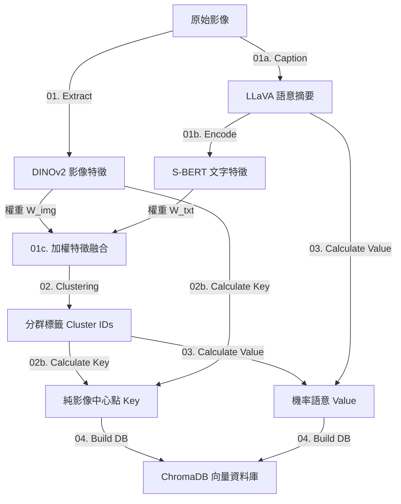

# 🗺️ 場景先驗記憶庫 (Scene Prior Memory Bank)


## 1. 專案簡介與核心架構

本專案旨在建置一個**高強健性、語意驅動**的場景記憶庫。為了解決傳統影像分群容易受光影、天氣（白天/夜晚/雨天）影響的問題，我們採用了 **"VLM-Memory"** 架構。

### 核心設計概念

:::info
利用 **LLaVA-NeXT (VLM)** 與 **S-BERT** 理解場景的「結構語意」（如：這是 T字路口、有 7-11），強迫模型忽略光影變化。這提供了高品質的分群指導信號。
利用 **DINOv2** 提取純影像特徵。在教師完成分群後，學生僅記憶每個群組的「純影像平均中心點」作為索引 Key。
:::

### 流程圖



## 2. 完整執行流程 (Pipeline)

請依照以下順序執行腳本。確保您處於已安裝好環境的 `memory_factory` Conda 環境中。

### 步驟 1：特徵提取 (Feature Extraction)

此階段將影像轉換為數學向量與語意文本。

1.  **提取影像特徵 (Student)**
    * 執行：`python 01_extract_feature.py`
    * 產出：`all_image_features.npy` (DINOv2, 768-d)
2.  **生成語意摘要 (Teacher Part 1)**
    * 執行：`python 01a_llm_semantic.py`
    * 說明：LLaVA 會遍歷所有影像，忽略移動物體與天氣，生成 JSON 結構化描述。
    * 產出：`llava_summaries.json`
3.  **提取文字向量 (Teacher Part 2)**
    * 執行：`python 01b_text_vector.py`
    * 說明：將 JSON 轉為字串並透過 S-BERT 編碼。
    * 產出：`all_text_features.npy` (S-BERT, 768-d)

### 步驟 2：特徵融合與參數優化 (Optimization & Fusion)

此階段決定如何結合影像與文字特徵以達到最佳分群效果。

4.  **尋找最佳融合權重 (Optional)**
    * 執行：`python evaluate_para.py` (請參考補充腳本)
    * 說明：透過 Grid Search 找出最佳的 `IMAGE_WEIGHT` 與 `TEXT_WEIGHT` 組合。
5.  **執行加權融合**
    * 執行：`python 01c_merge_feature.py`
    * 設定：請在腳本內修改 `IMAGE_WEIGHT` 與 `TEXT_WEIGHT` (推薦：Img 0.6 / Txt 0.4)。
    * 產出：`all_joint_features.npy` (Concatenated, 1536-d)
6.  **尋找最佳 K 值 (Optional)**
    * 執行：`python find_best_k.py` (請參考補充腳本)
    * 說明：使用 Silhouette Score 評估不同 K 值 (群組數) 的品質。

### 步驟 3：分群與後處理 (Clustering & Post-processing)

此階段是系統的核心，決定了記憶庫的結構。

7.  **執行 VLM 指導分群**
    * 執行：`python 02_run_clustering.py`
    * 邏輯：
        * 使用 **融合特徵** 進行 K-Means 初始化。
        * 計算 Cosine Similarity 矩陣。
        * 若相似度 > `MERGE_THRESHOLD` (如 0.92)，自動合併相似群組。
    * 產出：`cluster_labels.npy` (最終的分群標籤)

8.  **計算純影像中心點 (Key Generation)**
    * 執行：`python 02b_calculate_means.py`
    * **關鍵步驟：** 這裡拋棄了融合特徵，改用 `cluster_labels` 對應回 `all_image_features.npy` (DINOv2) 計算平均值。
    * 目的：確保上線時，只需影像特徵即可查詢，不需 VLM 介入。
    * 產出：`image_only_cluster_centers.npy` (Fast Keys)

9.  **計算語意機率 (Value Generation)**
    * 執行：`python 03_calculate_probabilities.py`
    * 說明：統計同一群組內所有 LLaVA JSON 的特徵頻率，轉化為機率分佈 (e.g., {"T-junction": 0.9, "Crossroad": 0.1})。
    * 產出：`semantic_summaries.json` (Probabilistic Values)

### 步驟 4：資料庫建置與驗證 (Database & Verification)

10. **建置 ChromaDB**
    * 執行：`python 04_build_memory_db.py`
    * 說明：將 Key (純影像中心) 與 Value (機率語意) 寫入向量資料庫。
    * 產出：`memory_db_chroma/` 資料夾

11. **視覺化驗證結果**
    * 執行：`python 05_visualize_clusters.py`
    * 說明：將影像複製到 `all_clusters_visualization/` 下的分類資料夾中。
    * **檢查重點：** 打開資料夾，確認同一群組內是否**混和了不同天氣/光影但相同地點**的影像。


## 4. 腳本詳細參數說明

### `01c_merge_feature.py`
:::warning
請確保影像與文字維度一致 (本專案預設皆為 768)，並在此設定權重。
:::

```python
# 權重設定 (建議根據 02_evaluate_weights.py 的結果調整)
IMAGE_WEIGHT = 0.6 
TEXT_WEIGHT = 0.4
# 模式：Concatenate (拼接)
```

### `02_run_clustering.py`
```python
# 初始 K 值 (建議設稍大，讓演算法有空間合併)
INITIAL_K = 36 
# 合併門檻 (越高代表越嚴格，越不像就不合併)
MERGE_THRESHOLD = 0.92
```

### `03_calculate_probabilities.py`
```python
# 機率門檻 (只保留出現機率高於此值的特徵)
PROBABILITY_THRESHOLD = 0.5
```